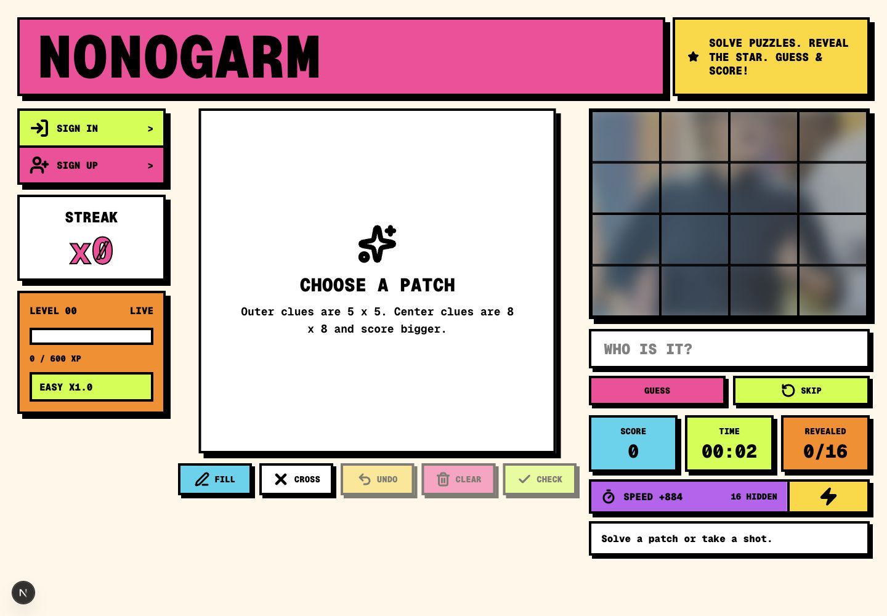
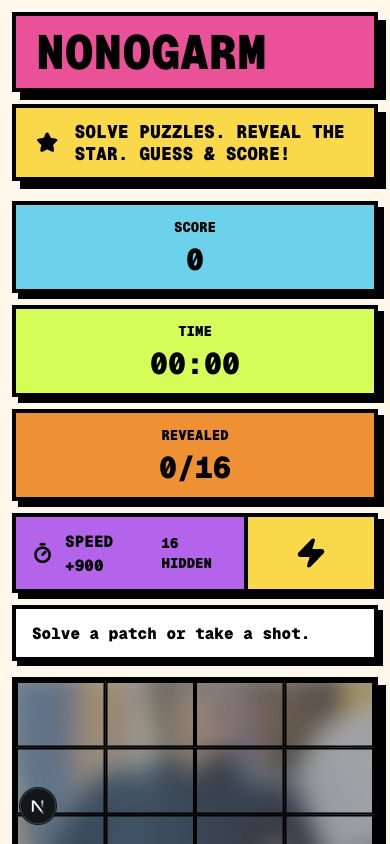

# Predaja projekta: Nonogarm

## Opis igre

Nonogarm je browser igra koja kombinuje klasični nonogram sa pogađanjem skrivene osobe. Igrač bira djelove zamućenog portreta podijeljenog u mrežu 4 x 4. Svaki izabrani dio otvara poseban nonogram zadatak. Kada se nonogram tačno riješi, taj dio portreta se otkriva, a igrač može u bilo kom trenutku pokušati da pogodi ime osobe.

Igra koristi portrete regionalnih muzičara i izvođača. Pogađanje je fleksibilno: prihvata velika i mala slova, varijante bez dijakritika i unaprijed definisane alternativne nazive. Rezultat zavisi od brzine, broja riješenih polja, težine osobe, broja grešaka pri provjeri nonograma i broja još uvijek sakrivenih djelova portreta.

## Opis inovacija u odnosu na original

Originalni nonogram se obično završava samim otkrivanjem slike kroz jednu logičku mrežu. Nonogarm dodaje novi cilj: igrač ne rješava samo sliku, nego koristi djelimično otkrivene tragove da pogodi skrivenu osobu.

Glavne inovacije su:

- portret je podijeljen u 16 posebnih djelova, pa igrač sam bira kojim redom otkriva tragove;
- svaki dio portreta ima svoj nonogram, pri čemu su centralni djelovi teži i koriste mrežu 8 x 8, dok spoljašnji djelovi koriste mrežu 5 x 5;
- nonogrami se generišu u memoriji na početku runde, tako da su stabilni tokom jedne runde, ali se mogu promijeniti u novoj rundi;
- bodovanje nagrađuje brzo rješavanje, manji broj grešaka, niz uspješnih poteza i ranije pogađanje osobe;
- unos odgovora je prilagođen korisniku jer podržava različite zapise imena, bez obaveze tačnog kucanja dijakritika;
- igra ima arkadni neobrutalistički vizuelni stil, HUD za rezultat, vrijeme, težinu i napredak, kao i leaderboard/progres sistem za prijavljene korisnike.

## Korišteni AI alati

Tokom izrade projekta korišteni su AI alati za pomoć u planiranju, implementaciji i dokumentovanju:

- OpenAI ChatGPT/Codex - razrada ideje igre, definisanje mehanike, organizacija komponenti, pisanje i izmjena koda, pomoć pri testiranju logike i priprema dokumentacije.

## Screenshotovi igre

Screenshotovi igre su dodati u folder `docs/screenshots/`.

Uključeni screenshotovi:

- `docs/screenshots/nonogarm-desktop.png` - desktop prikaz glavnog ekrana igre;
- `docs/screenshots/nonogarm-mobile.png` - mobilni prikaz igre.

## Link do repozitorijuma

GitHub repozitorijum: [https://github.com/AsanovskiAna/nonogram](https://github.com/AsanovskiAna/nonogram)
